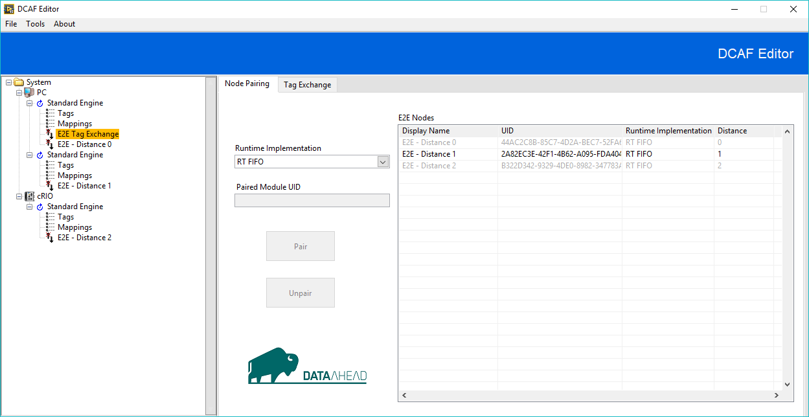
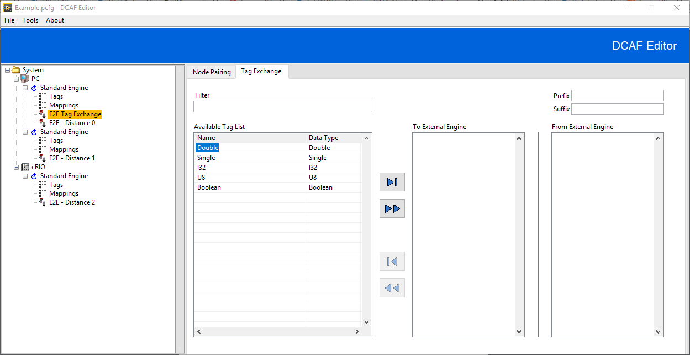
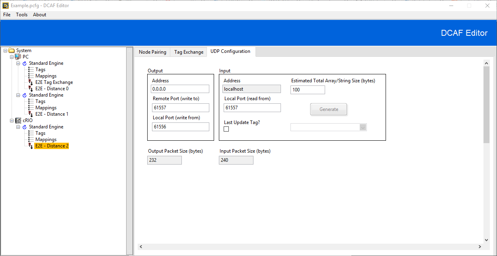
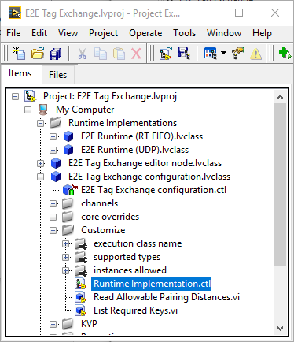

# Engine-to-Engine Tag Exchange (E2E)

The Engine-to-Engine Tag Exchange (E2E) module is meant to simplify the exchange of tags between separate DCAF engines. Rather than configuring output and input channels manually using a specific I/O Module to exchange tags, the E2E module handles channel configuration automatically when a tag is selected to be shared between engines. The editor node of the E2E module also allows the user to determine the transfer mechanism for tag exchange. The transfer mechanism determines the allowable data types, the pairing depth (inner-target, inter-target, both), and other specific configuration information. The module was designed to allow for users to create and add new transfer mechanisms. The first two implemented mechanisms were UDP and Single Element RT FIFOs.

# Configuring the E2E Module

### Node Pairing

E2E modules exchange tags by pairing with each other on a one-to-one basis. When an E2E module is selected, the **E2E Nodes** table will display all other E2E modules in the configuration. Pair a module by selecting an enabled row in the table and clicking **Pair**. Use the **Unpair** button to unpair the paired modules.

**Runtime Implementation:** Determines which runtime component is used to exchange tags, which pairing distances are acceptable, the data types that can be exchanged, and other specific configuration information. Currently supported runtime implementations are:
+ RT FIFO
+ UDP

**Paired Module UID:** The unique identifier of the module currently paired to the active module.

**Pair:** Pairs the active module to the E2E module selected in the **E2E Nodes** list.

**Unpair:** Unpairs the active module with the E2E module identified by the **Paired Module UID**.

**E2E Nodes:** List of all other E2E modules in the current configuration.  
+ **Display Name:** The module's current alias.
+ **UID:** The unique identifier of the module.
+ **Runtime Implementation:**
+ **Distance:** The relationship of the selected E2E module to the active module. The distance can be one of the following values:
  + **0:** The module is under the same engine.
  + **1:** The module is under a different engine in the same target.
  + **2:** The module is under a different engine in a different target.

> **Note:** The row for a specific module in **E2E Nodes** list will be disabled if one of the following conditions is met.
>+ The runtime implementation of the listed module does not match the runtime implementation of the active module.
>+ The module is already paired.
>+ The runtime implementation doesn't support the pairing distance (e.g. RT FIFOs cannot exchange tags between separate targets).

### Tag Exchange

**Filter:** Filter list of tags using the syntax of the [Match Pattern](http://zone.ni.com/reference/en-XX/help/371361R-01/glang/match_pattern/) primitive.

**Available Tag List:** Tags that are currently available for exchange. Clicking the **Move Right** button will move the currently selected tag in the **Available Tag List** into the **To External Engine** list. Move all tags from the **Available Tag List** into the **To External Engine** list by clicking the **Move All Right** button.

**To External Engine:** Tags currently configured for transfer to the external engine. Clicking the **Move Left** button will move the currently selected tag in the **Available Tag List** into the **To External Engine** list. Move all tags from the **Available Tag List** into the **To External Engine** list by clicking the **Move All Left** button.

**From External Engine:** Tags coming from the paired E2E module.

**Prefix:** A string concatenated to the front of all input tag names.

**Suffix:** A string concatenated to the end of all input tag names.

### UDP Configuration

If UDP has been selected as the runtime implementation, the following configuration tab will become available.

##### Output
+ **Address:** The network address to write to.
+ **Remote Port (write to):** The UDP port to write to. This value should match the value of **Local Port (read from)** in the paired E2E module.
+ **Local Port (write from):** The UDP port to write from.

##### Input
+ **Address:** Currently non=configurable as the module will always read from localhost.
+ **Local Port (read from):** The UDP port to read from. This value should match the value of **Remote Port (write to)** in the paired E2E module.
+ **Last Update Tag?:** If selected, a channel of type double will be created. This channel will contain a timestamp with the last successful read time. Use the drop down menu to map the channel to an existing tag or click **Generate** to create and map a tag to the channel.
+ **Estimated Total Array/String Size (bytes):** This input will be available if the tags from the eternal engine contain data types of dynamic size (strings and arrays). The UDP runtime component will attempt to read a packet from the input port with a max size determined by the size of the statically sized tags, the packet header, and the value contained in this input plus a small buffer.

# Classified Errors

The following errors are classified by the E2E module.

Error Number | Description | Classification
---|---|---
-2200 | Unknown internal error. | Critical
-2206 | RT FIFO does not exist. | Critical

# Adding Additional Transfer Mechanisms

The E2E Tag Exchange Module was designed to allow for additional transfer mechanisms to be implemented. The E2E module uses case structures wired to the “Runtime Implementation.ctl” type definition without a “Default” case to force the developer to override necessary functionality. After overriding all necessary behavior for the configuration and editor components of the E2E module, the runtime component of the new transfer mechanism needs to be developed. VIs requiring modification will typically be found in virtual folders named “Customize” in the LabVIEW project explorer.

### Modifying the Configuration Class

Begin by adding the name of the new transfer mechanism to `Runtime Implementation.ctl` type definition.

After applying changes to the type definition, the following configuration class methods need to be edited to handle the new implementation.

VI Method | Required Changes
---|---
get supported types.vi | Return an array of the data types supported by the new implementation
instance count allowed.vi | Return the number of module instances allowed per engine based on the current runtime implementation. A value of -1 corresponds to unlimited instances.
Read Allowable Pairing Distances.vi | Return an array of the pairing distances that are supported by the runtime implementation. The following values are supported <li>0: E2E module in the same engine.</li><li>1: E2E module in a different engine in the same target.</li><li>2: E2E module in a different engine in a different target.</li>
get channels.vi | Return an array of channels currently configured by the module. If your runtime implementation supports additional channels besides the tag exchange channels, add them here. See the UDP implementation for an example. Do not add any additional input or output channels as the channel sorting and tag engine between modules may be incorrect.
List Required Keys.vi | The E2E module uses key-value pairs to store runtime implementation specific configuration. If your runtime implementation has additional configuration information, add the keys and initial values here. Use the “Read Key.vi” and “Write Key.vi” methods in the E2E configuration class to access the key-value pairs.
execution class name.vi | Returns the class name of the runtime component for the current runtime implementation. Return the name of the runtime class for your new implementation.

### Modifying the Editor Node Class

The following editor class methods need to be edited

VI Method | Required Changes
---|---
Read Panel Info.vi | If your runtime implementation has specific configuration information, return the name you would like for the configuration tab and a reference to a VI that is used to modify the configuration information. `UI Template.vit` has been created to define a VI server interface and to simplify the creation of the VI. See the UDP runtime component as an example.

### Creating the Runtime Class

Create a new LabVIEW class that inherits from TBM module execution interface.lvclass. The input and output channels configured by the editor and loaded during the init.vi override will match properly between paired modules. Use `Read Key.vi` in the `init.vi` override to access specific runtime configuration. No other logic is necessary for the E2E tag exchange. See the UDP runtime class for an example.

# Required Software

+ LabVIEW 2015 or later
+ DCAF Tag Editor 2.1.3.172 or later
+ DCAF Standard Engine 2.4.0.8 or later

# Acknowledgements

Special thank you to Ian Knox at [Data Ahead AG](https://dataahead.de/en/) for the initial development and continued support of the E2E module.
